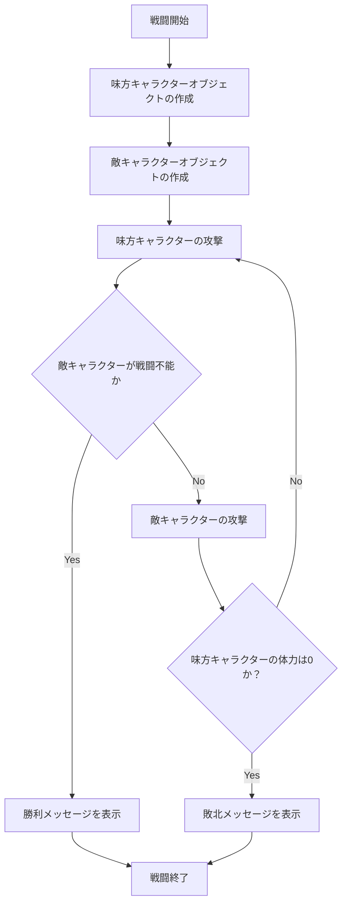

# 開発パート01: キャラクターが戦うプログラムを作成する

まずは味方キャラクターと敵キャラクターが交互に攻撃し合い、体力が０になるまで繰り返すという処理を作成していきます。

## 1. Monster クラスの作成

味方キャラクターと敵キャラクターのベースになる、Monsterクラスを作成していきます。
`main.py` と同じ階層に `Monster.py` を作成し、以下の内容を記述してください。

Monster クラスで設定するべきは、以下の通りです。

| 項目名 | アクセス属性 | 型 | 備考
| --- | --- | --- | ---
| 名前 | protected | string | キャラクターの名前を設定する
| 体力 | protected | int | 現在の体力の値を保持する
| 最大体力 | protected | int | キャラクターの最大体力
| 攻撃力 | protected | int | キャラクターの攻撃力
| 防御力 | protected | int | キャラクターの防御力
| 戦闘不能 | protected | boolean | キャラクターの体力が0になった時にtrue

また、Monster クラスは、以下のメソッドおよびコンストラクタを持ちます。

::: info
プロパティ名は各自で検討して決定してください。プロパティ名、変数名を考えるのも重要なスキルです。
:::

| 項目名 | 引数 | アクセス属性 | 返り値の型 | 備考
| --- | --- | --- | --- | ---
| 攻撃する | Monster オブジェクト | public | void | 引数に設定されたキャラクターにダメージを与える。抽象メソッドとして定義すること
| コンストラクタ | 戦闘不能 以外のプロパティ | public | --- | オブジェクト生成時に、メンバ変数の値を任意に設定できるようにする

これらのほかにも、プロパティのアクセサメソッド（get_xxx/set_xxx）を設定してください。

:::info
戦闘不能の変数のセッターは、他の変数とは異なる作り方が必要になります。  
「戦闘不能かどうか」は、引数よって外部から変更されるべきものではなく、「キャラクターの体力が0かどうか」によって判定・設定されるべきものです。  
現在の体力を参照して内容を決めるようにしてください。
:::

## 2. MyMonster クラス、EnemyMonster クラスの作成

Monster クラスを継承し、オブジェクトを生成するためのクラスを作成します。  
味方キャラクター用にMyMonster クラスを、敵キャラクター用にEnemyMonsterクラスを作成します。  
開発パート01 では、2つの内容に差はありません。いずれも同じ内容で作成してください。  
`main.py` と同じ階層に `MyMonster.py` と `EnemyMonster.py` を作成し、以下の内容を記述してください。

MyMonster クラス、およびEnemyMonster クラスは、以下のメソッドを持ちます。

| 項目名 | 引数 | アクセス属性 | 返り値の型 | 備考 
| --- | --- | --- | --- | --- 
| 攻撃する | Monster オブジェクト | public | void | Monster クラスの抽象メソッドをオーバーライドする。 与えるダメージを計算し、ダメージ量を文字画面上に出力する。 また、引数のMonsterオブジェクトの体力を、ダメージ分減少させる。

:::info
ダメージ計算式は、特に指定しません。  
どのくらいのターンで決着がつくようにするか、体力の数値をいくつにするか、などもいろいろ考えながら、計算式を設定してみてください。
:::

## 3. main() メソッドの作成

Monster クラスを作成し、キャラクターをオブジェクト化できるようになったら、次はmainを作成していきます。  
`main.py` を作成します。

まず、ゲームの基本となる戦闘の処理を作成していきます。  
戦闘処理のフローチャートを例示します。以降、プログラム作成の手順に悩んだら、以下のようなフロー図を書いてみて、作るべきプログラムを可視化してみましょう。  

## 4. 動作の確認

`main.py` の処理を書き終わったら、動作に問題がないかを確かめていきます。  
すくなくとも、以下のパターンでエラーが起こらないことを確認してください。  

:white_check_mark: 勝利した場合の動作  
:white_check_mark: 敗北した場合  
:white_check_mark: オブジェクト生成の際に、体力や攻撃力に不正な値（負の数など）を設定した場合の動作

## 5. 余裕のある方への追加ミッション

### 素早さステータスの実装

戦闘の際の攻撃順を、キャラクターのステータスによって変化させてみましょう。  
Monster クラスに「素早さ」の変数を追加し、素早さの早いキャラクターが先に攻撃できるように変更を加えてください。  

### クラスファイルをパッケージで管理する

Monster クラス、MyMonster クラス、EnemyMonster クラスを`Monster` パッケージに切り分けて管理してみましょう。  
モジュール化することで、クラスの内容を他のプログラムからも利用できるようになります。

Python のパッケージの作成方法は、おのおの調べてみてください。
