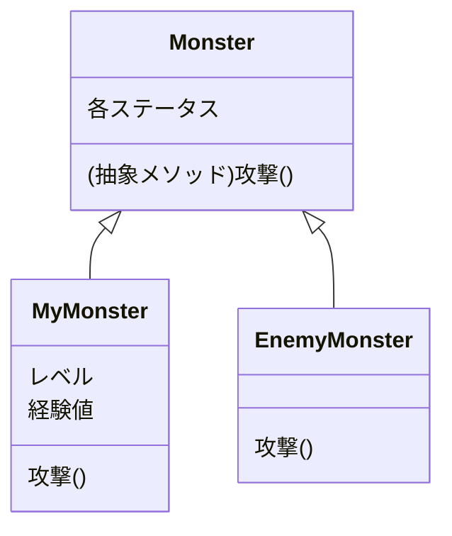
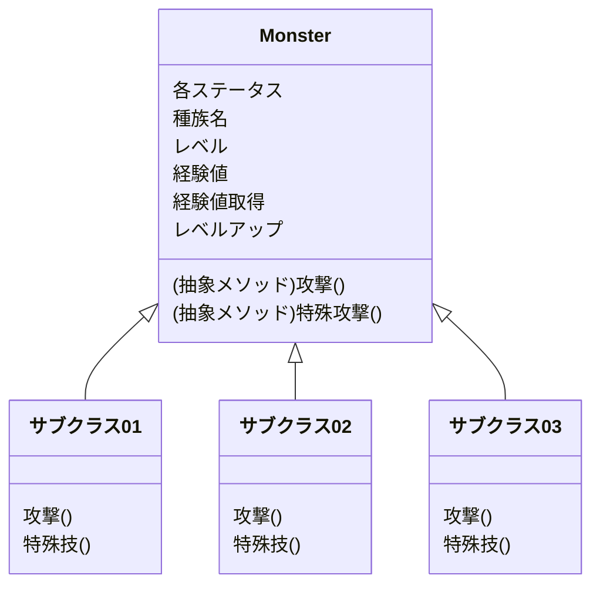

# 開発パート09: キャラクターごとに特殊技を実装する

つぎは、モンスターに特殊技を実装して、戦闘時のコマンド「特殊技」から実行できるようにしていきましょう。

このパートで実装すべき機能は、以下の通りです。

1. Monsterクラスのクラス継承を修正・変更する
2. Monsterクラスのサブクラスとして、新たに固有のキャラクターのクラスを作成する
3. 戦闘時のコマンドに、「特殊技」を追加する

順番に実装方法を確認していきます。

## 1. Monster クラスの継承関係を修正・変更する

これまでは簡易的に継承の機能を使ってみるために、「味方キャラクター」と「敵キャラクター」の2つに分けて実装してきました。  
ここからはキャラクターごとに固有な処理を設定できるように、クラスをさらに分けてみましょう。

まず、現時点での継承関係を確認しておきます。

これを、以下のように変更しましょう。

MyMonster クラスとEnemyMonster クラスではなく、キャラクターの種類によってクラスを分けるということをしてみましょう。  

レベルや経験値など、MyMonster クラスのメンバ変数として作成していたものをMonster クラスへ移動させ、キャラクターの基本的な情報はすべてMonster クラス内へ集約します。

また、今後のパートで敵キャラクターを味方に加える機能を作成するため、キャラクターとして共通する情報はMonster クラスで利用できるようにしておきます。

この変更にあわせて、新たに「種族名」を設定してください。「種族名」とは、サブクラスの名前です。  
今まで設定していた、キャラクター自身の名前とは異なり、おなじサブクラスのオブジェクトであれば共通となります。

また、サブクラスごとに、`特殊技()` メソッドの内容をそれぞれ変えて実装してください。  
これまで利用していたMyMonster クラスとEnemyMonster クラスは、今後は利用しなくなりますので、削除していただいてもかまいません。

:::info
この変更によって、既存の各機能の修正が発生すると思います。  
MyMonster とEnemyMonster を利用していた部分は少なくない修正をすることになりますが、どのように書き換えるとうまく動きそうか、これまでの知識を整理しながら修正してみてください。
:::

## 2. Monster クラスのサブクラスとして、新たに固有のキャラクターのクラスを作成する

Monster クラスの修正を行った後、新たにサブクラスを作成します。

サブクラスには、以下のメソッドおよびコンストラクタを作成してください。

| 項目名 | 引数 | 返り値の型 | 備考
| --- | --- | --- | ---
| 攻撃 | Monster オブジェクト | None | 引数に設定されたキャラクターにダメージを与える。
| 特殊技 | 任意 |  | サブクラスごとに、様々な効果を設定する
| コンストラクタ | 各メンバ変数の値 |  | メンバ変数の値と、種族名を設定する

## 3. 戦闘時のコマンドに、「特殊技」を追加する

戦闘時に選択するコマンドに新たに「特殊技」を追加します。  
コマンド選択時には、攻撃メソッドではなく、特殊技メソッドを実行するようにしてください。  

## 4. 動作の確認

Monster のサブクラスの作成と、特殊技の使用ができるようになったら、動作に問題がないかを確かめていきます。  
すくなくとも、以下のパターンでエラーが起こらないことを確認してください。  

:white_check_mark: 特殊技を使用して、正しく戦闘を継続・終了できるか  
:white_check_mark: キャラクターごとに正しい特殊技を使用しているか  
:white_check_mark: 通常の攻撃を行った際の動作に、影響が発生していないか  

## 5. 余裕のある人向けの追加ミッション

### 敵が特殊技を使うようにする

こちらの攻撃だけでなく、敵からも特殊技で攻撃されるようにしてください。  
一定確率で発生させる、体力が特定の割合以下だと実行する、など、いくつかのシチュエーションで特殊技を使ってくるようにしてみましょう。

### 特殊技の回数制限

1度の戦闘で特殊技を利用できる回数に制限を設けましょう。  
ステータスとして、「特殊技使用回数」や「魔力」などを実装して、特殊技使用時にそれらを減少させる、などの使用を実装してみましょう。

### ステータス変化系の特殊技を実装する

戦闘中のみ、相手のステータスを低下させ、または自分のステータスを向上させる特殊技を実装してみましょう。  
戦闘終了時にステータスをもとに戻すにはどうしたらいいか、考えて実装してみてください。  
